In this project, I built a network monitoring and intrusion detection system using Nagios Core. First, I created a small enterprise network to test the project. Then, I installed and configured Nagios Core to monitor devices, services, and network traffic. The system can show real-time information about the health, performance, and security of the network. This document explains step by step how I designed the network, set up the tools, and tested the system.

---
***Note: in this Blog we are not going to talk about the installation porcess of the Tools and Technologies that we used to build this Project, I recommend go to the official Documentation Website for better understanding.***

## Tools and Technologies Used

The creation of the simulated environment and the monitoring solution relied on the integration of several key technologies:

*   **Nagios Core:** The central monitoring engine. A powerful, open-source application used to monitor systems, networks, and infrastructure, providing robust alerting for servers, switches, and services.
*   **GNS3 (Graphical Network Simulator 3):** A network software emulator used to design and simulate the complex, multi-layered enterprise network topology.
*   **VMware Workstation Player:** A virtualization software used to host the virtual machines for the servers (e.g., DB Server, Web Server).

---

## Phase 1: Simulated Network Environment Preparation

A foundational requirement for this project was a realistic network that mirrors a typical corporate infrastructure. This was achieved by designing a hierarchical network model using GNS3, complete with proper segmentation and security zones.

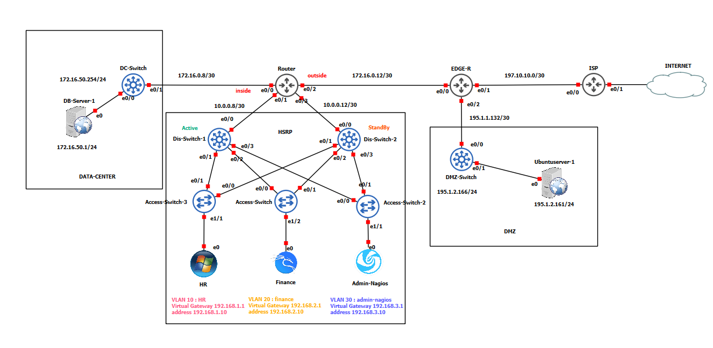

The architecture was built on a three-layer hierarchical model (Core, Distribution, Access) and was segmented using VLANs for key departments to enhance security and organize traffic:
*   **VLAN HR**
*   **VLAN Finance**
*   **VLAN Nagios-Admin**
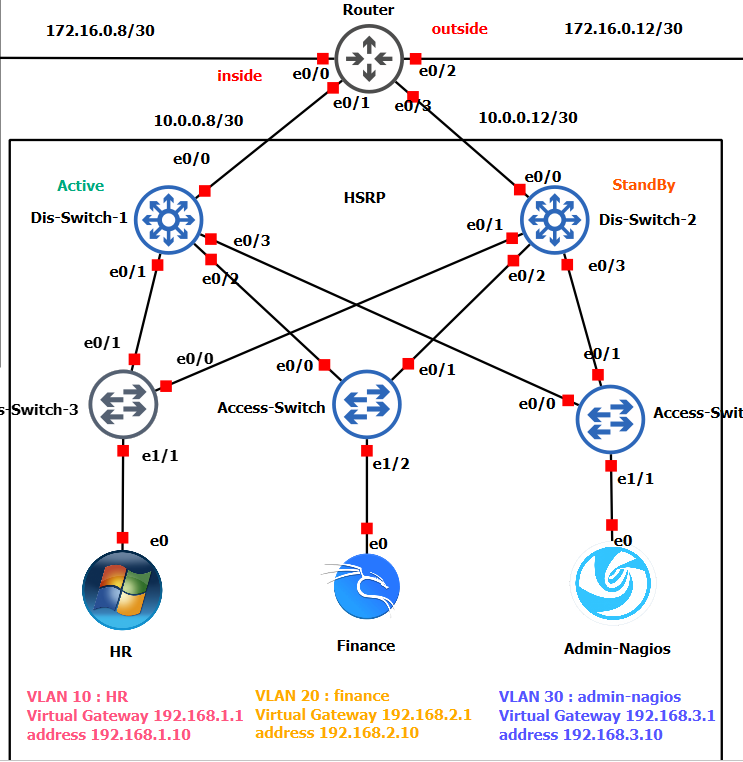

Two critical security zones were integrated to reflect a complete enterprise architecture:
*   **DMZ (Demilitarized Zone):** A perimeter network hosting public-facing services like the Web Server.
*   **Data Center:** A highly secured internal zone housing critical assets like the DHCP,DNS and DataBase Server.

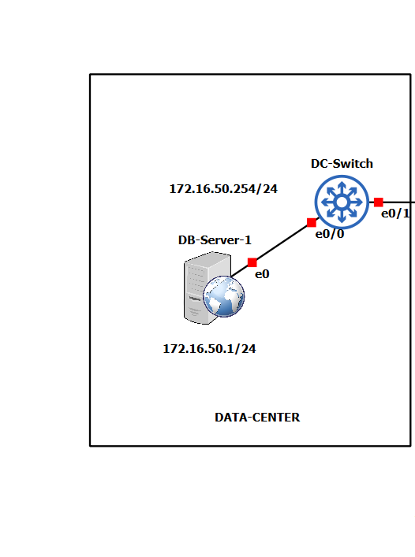

## Phase 2: Nagios Core Configuration - A Deep Dive

With the network established, the core of the project was the comprehensive configuration of Nagios Core. All object definitions are stored in `/usr/local/nagios/etc/objects/` and are referenced by the main `nagios.cfg` file.

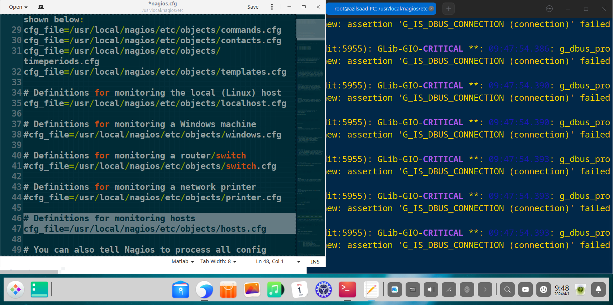

#### Defining Hosts to Monitor (`hosts.cfg`)

All critical infrastructure components were defined as "host" objects. Each host has a unique name, an IP address, and uses a template to inherit common properties, reducing configuration redundancy.
**Some Config Syntax Example :**
##### Define the Database Server in the Data Center
```
define host {
    use             linux-server          ; Inherit properties from the linux-server template
    host_name       DB-Server             ; Unique name for the host
    alias           DATABASE SERVER       ; A descriptive alias
    address         172.16.50.1           ; IP address of the server
}
```
##### Define the Web Server in the DMZ
```
define host {
    use             linux-server
    host_name       Web-Server
    alias           WEB SERVER
    address         195.1.2.161
}
```
and there is other config you Can Add , For Example : 
```
define host {
    ...
    ; Try 5 times before marking the host as down
    max_check_attempts         5

    ; Ping check: warning >100ms or 20% loss, critical >500ms or 60% loss
    check_command              check_ping!100.0,20%!500.0,60%

    ; Send notifications at any time (24 hours, 7 days)
    notification_period        24x7

    ; Notify when host is down (d), unreachable (u), or recovered (r)              
    notification_options       d,u,r

    ; Check the host every 5 minutes           
    check_interval             5                     
}
```
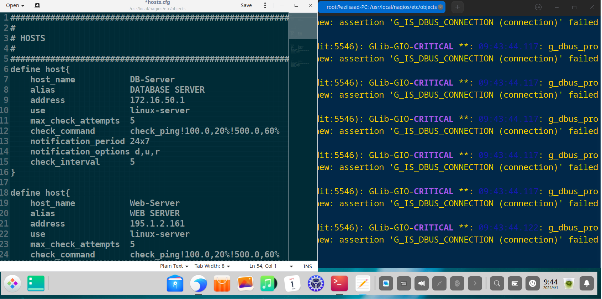

#### Defining Services to Monitor (`services.cfg` & `switch.cfg`)

For each host, specific "services" were defined to provide granular insight into device health. This includes standard service checks like HTTP and SSH, as well as more advanced checks using SNMP for network devices.

##### Monitor the HTTP service on the Database Server
```
define service {
    use                     generic-service     ; Inherit default service properties
    host_name               DB-Server           ; Associate with the DB-Server host
    service_description     HTTP Server DATABASE; Description of the service
    check_command           check_http          ; Plugin to run to check the service
}
```
##### Monitor SSH on the Database Server
```
define service {
    use                     generic-service
    host_name               DB-Server
    service_description     SSH Server DATABASE
    check_command           check_ssh
}
```
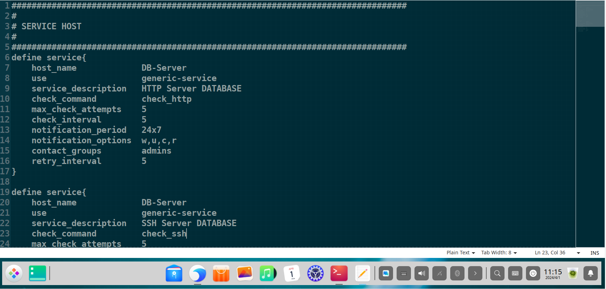


#### Monitor Switch Uptime via SNMP

For network switches, SNMP was enabled to monitor resource utilization such as CPU and memory usage, port status, and traffic bandwidth.
```
define service {
    use                     generic-service
    host_name               Dis-Switch-1
    service_description     Uptime
    check_command           check_snmp!-C public -o sysUpTime.0
}
```
##### Monitor Switch Port 1 Link Status via SNMP
```
define service {
    use                     generic-service
    host_name               Dis-Switch-1
    service_description     Port 1 Link Status
    check_command           check_snmp!-C public -o ifOperStatus.1 -r 1 -m RFC1213-MIB
}
```
##### Monitor Switch Port 1 Inbound Traffic via SNMP
```
define service {
    use                     generic-service
    host_name               Dis-Switch-1
    service_description     Port 1 In
    check_command           check_snmp!-C public -o 1.3.6.1.2.1.2.2.1.10.1
}
```


#### Organizing with Hostgroups and Servicegroups

To simplify management, hosts and services were organized into logical groups. This allows for consolidated views and streamlined reporting.

##### Define a hostgroup for all network switches
```
define hostgroup {
    hostgroup_name  switches
    alias           Network Switches
    members         Dis-Switch-1, Dis-Switch-2, DC-Switch
}
```
##### Define a servicegroup for network-related services
```
define servicegroup {
    servicegroup_name   network-services
    alias               Network Services
    members             switch1,CPU Usage,switch1,Memory Usage
}
```
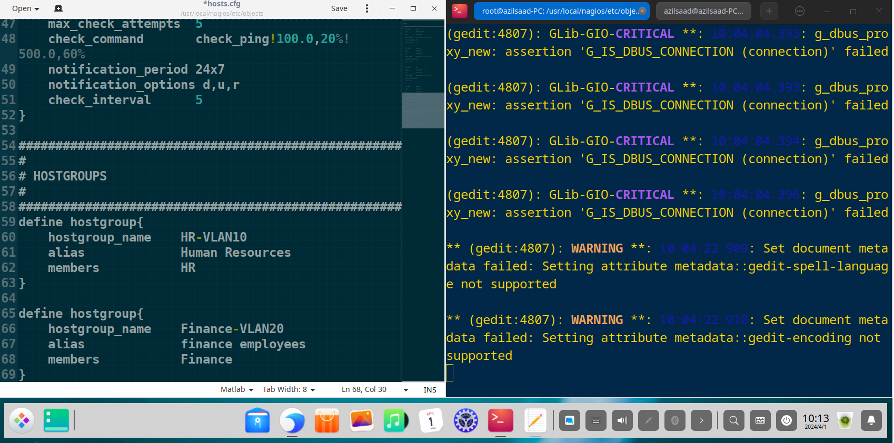

#### Configuring Contacts and Notifications (`contacts.cfg`)

Effective monitoring requires robust alerting. "Contacts" and "contact groups" were defined to ensure the correct administrators are notified of issues via email.

##### Define an individual administrator contact
```
define contact {
    contact_name    admin1
    alias           Admin One
    email           azilsaad06@gmail.com
}
```
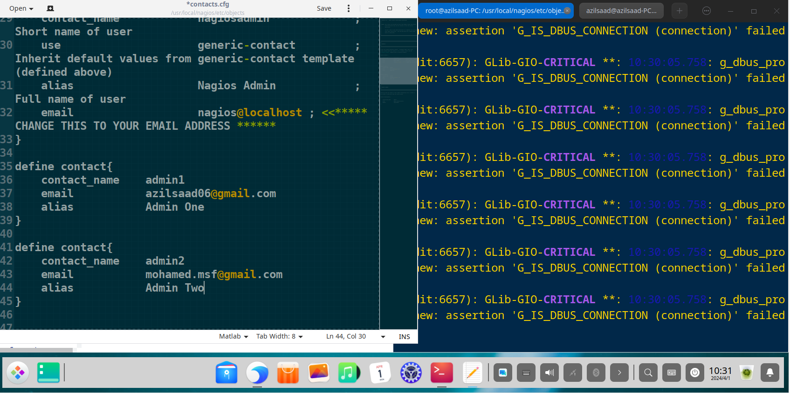
##### Define a contact group for all administrators
```
define contactgroup {
    contactgroup_name   admins
    alias               Nagios Administrators
    members             nagiosadmin, admin1, admin2
}
```
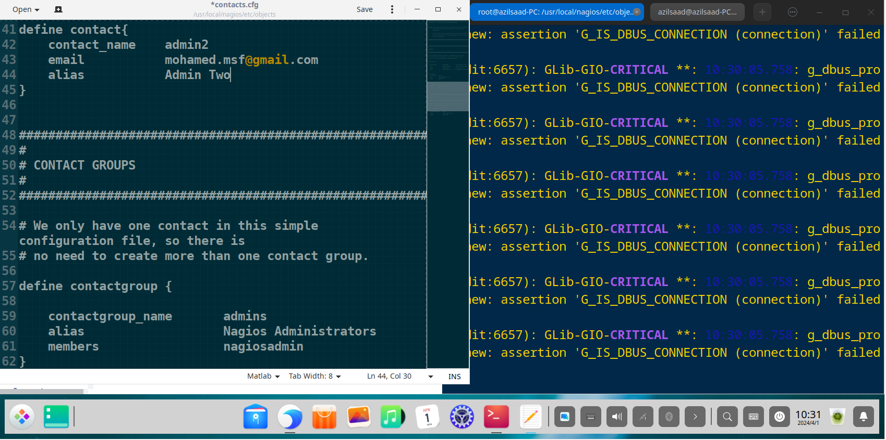

## Phase 3: Monitoring and Results Analysis via the Web Interface

With the configuration complete, the Nagios web interface becomes the central command center for visualizing network health.
first we need to start the apache service: 
```bash
sudo systemctl restart apache2.service
```
and restart the nagios daemon service, after the config we made : 
```bash
sudo systemctl start nagios.service
```
Now we can access the web page on your favorite Browser By typing this in url field : 
```bash
http://(YOUR IP ADDRESS)/nagios 
```
Enter the username and password and hit enter.
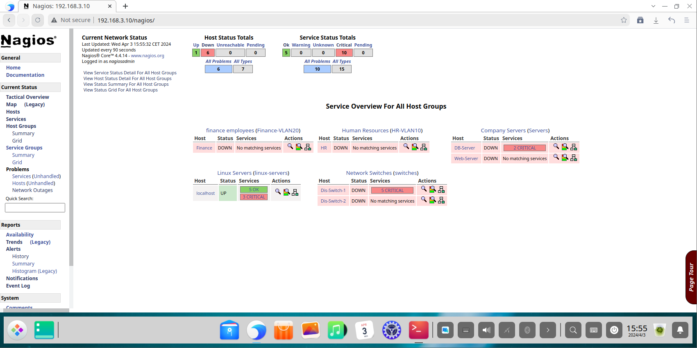

The **Tactical Overview** dashboard provides a high-level, at-a-glance summary, ideal for quick assessments by network operations staff.
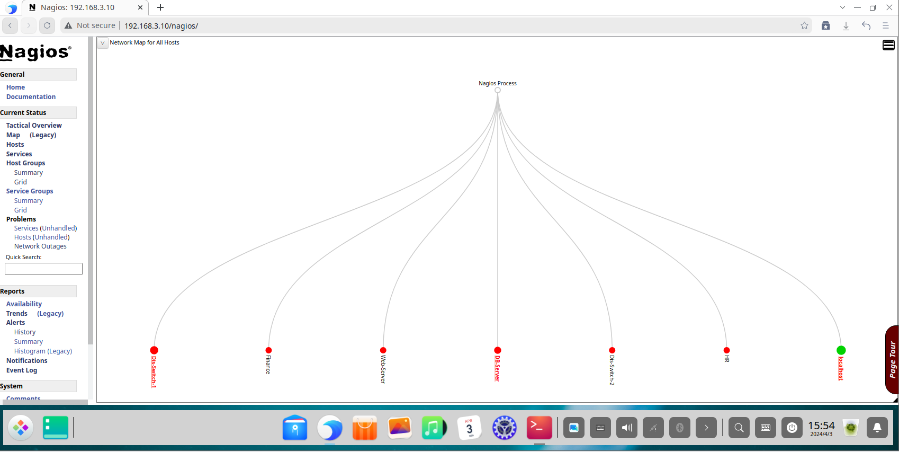

The **Host Status** page provides a detailed list of all monitored hosts, their current state, duration, and status information. This is the primary view for identifying device-level outages.
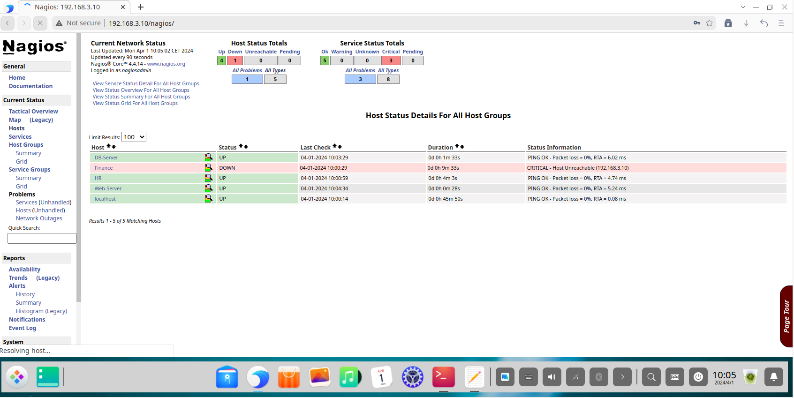

The **Service Status** page offers a granular view of every individual service being monitored across all hosts. This is critical for diagnosing specific service failures.
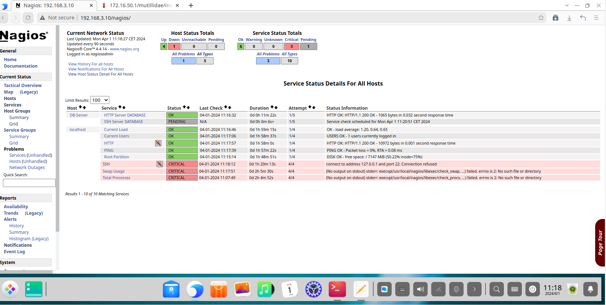

The **Host Groups** view allows administrators to see the collective status of all devices within a group, confirming that entire segments of the network (like all "switches" or all "servers") are operational.


The **Contacts Page Overview :** 
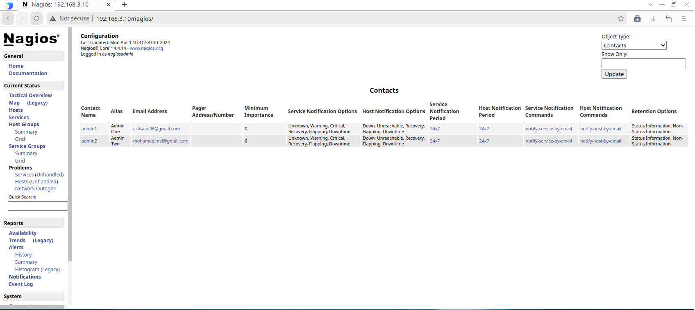

## Conclusion

This project successfully demonstrated the end-to-end implementation of a sophisticated network monitoring system using Nagios Core. By building a realistic, simulated enterprise network, we were able to configure and validate a monitoring strategy that provides deep visibility into network health, performance, and availability. This detailed walkthrough serves as a practical blueprint for deploying Nagios in real-world environments to achieve proactive monitoring, reduce system downtime, and enhance an organization's overall security posture.

***Note: This documentation does not include steps for monitoring Windows devices or setting up an SMTP server for email notifications. The project was originally built two years ago, and some related images were unfortunately lost.***

And we are done :)
