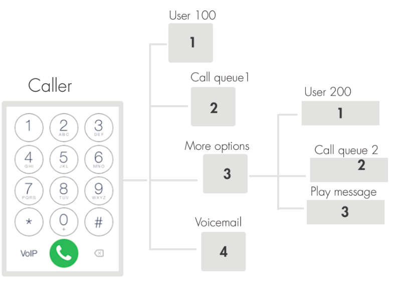
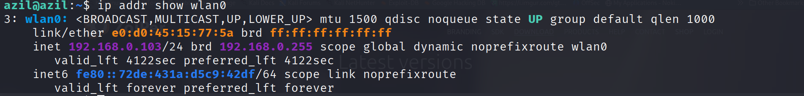
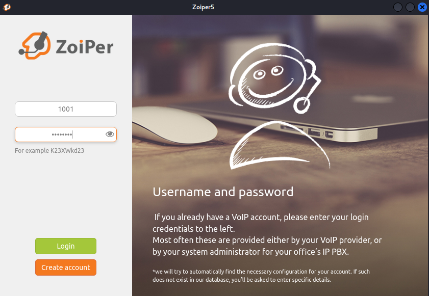
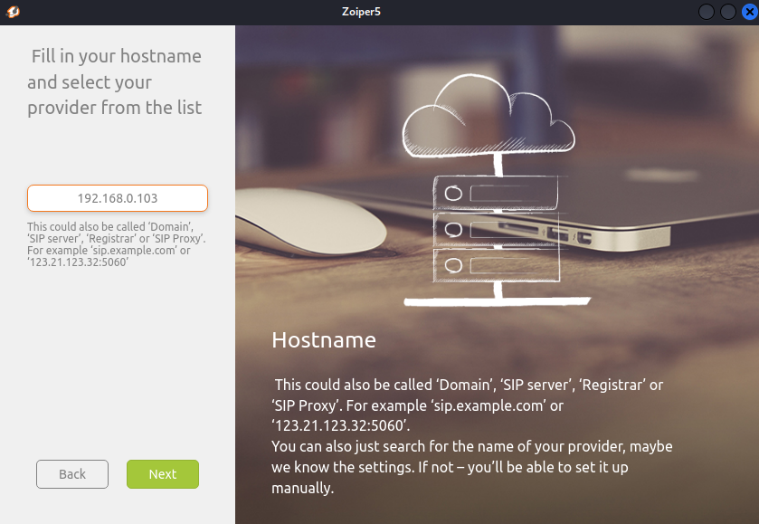
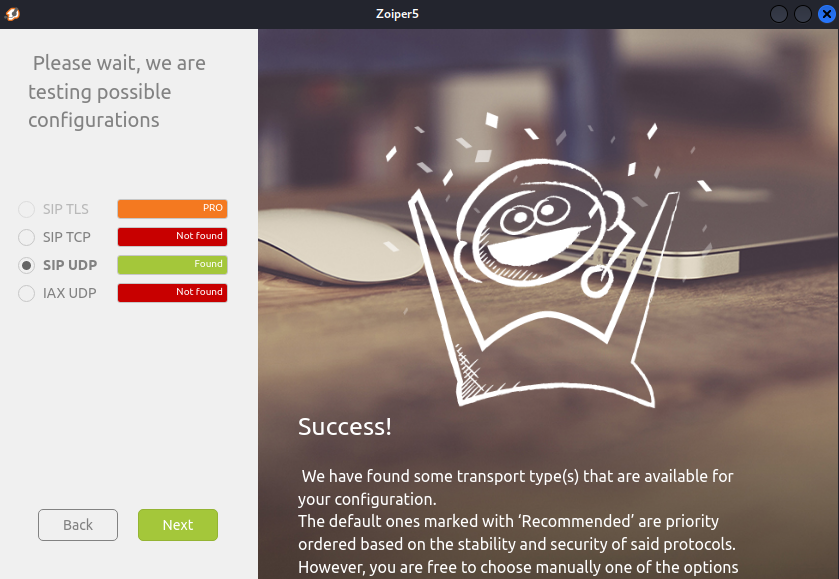
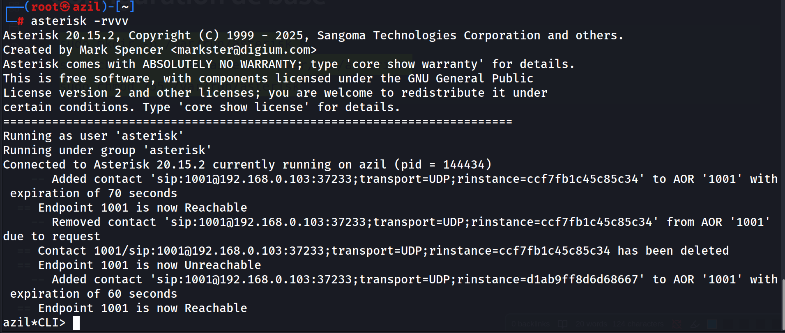
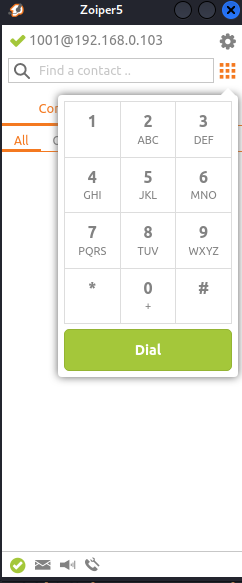
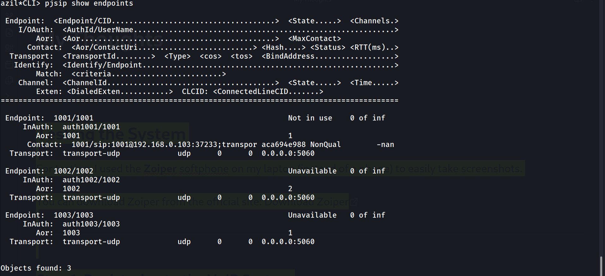

In this post, we’ll build upon our previous setup. Now that the basic configuration is complete, we’ll dive into implementing advanced features such as IVR and Conference.

---

## Interactive Voice Response (IVR)

### Whats an IVR
`Interactive Voice Response (IVR) is an automated telephony technology that allows callers to interact with a company’s host system via keypad inputs or voice commands. By guiding users through pre-recorded menus, IVR acts as a virtual receptionist, enabling self-service actions like checking account balances, routing calls to specific departments, or handling high-volume inquiries 24/7, ultimately reducing wait times and improving efficiency.`

I found this definition on Google, but in simple terms:
suppose the company number is 7000. When someone calls this number, they hear a pre-recorded message such as:

- Press 1 to contact Administration

- Press 2 if you have a problem with our service

- Press 3 to leave feedback and so on.

Based on the option selected, the system automatically forwards the call to the corresponding extension. For example, if the caller presses 2, the call is redirected to extension 2000.



### Configuration
Now, open the `extensions.conf` file to start configuring the IVR:
```bash
sudo nvim /etc/asterisk/extensions.conf
```

Under the `[local]` context, add a new extension:
```ini
exten => 7000,1,Goto(ivr-menu,s,1)
```

You can choose any unique number; it does not matter.

The `Goto()` application is used to redirect calls. Its syntax is:
```ini
exten => extension,priority,Goto(context,extension,priority)
```

In this case, the call is redirected to another context called `[ivr-menu]`.
The extension s stands for start, meaning the entry point of the context, and the priority is set to `1`.

Next, we need to define the `[ivr-menu]` context to handle user interaction:
```ini
[ivr-menu]
exten => s,1,Answer()
 same => n,Background(ChooseOption)
 same => n,WaitExten(10)

exten => 1,1,Dial(SIP/1000,20)
exten => 2,1,Dial(SIP/2000,20)
exten => 3,1,VoiceMail(3000@default)

exten => i,1,Playback(invalid)
 same => n,Goto(ivr-menu,s,1)

exten => t,1,Playback(vm-goodbye)
 same => n,Hangup()
```
this section its a sperate section from the `[local]` Context.

The call is answered using the `Answer()` application, then the welcome message is played using `Background(ChooseOption)`. The `ChooseOption` file is a pre-recorded audio message stored in `/var/lib/asterisk/sounds/en/`, in either `GSM` or `WAV` format.

The system waits 10 seconds for user input using `WaitExten(10)`.

When the caller presses:

`1` → the call is forwarded to extension `1000` using `Dial(SIP/1000,20)`

`2` → the call is forwarded to extension `2000` using `Dial(SIP/2000,20)`

`3` → the caller is redirected to voicemail `3000` using `VoiceMail(3000@default)`

If the caller enters an invalid option, the `Playback(invalid)` application is used, then the call is redirected back to the `IVR` menu using `Goto(ivr-menu,s,1)`.

If no input is received within the timeout period, `Playback(vm-goodbye)` is executed and the call is terminated using `Hangup()`

### The Diffirence Between Playback() & Background()
both applications let you to play music/sound files ,but when it comes to IVR we need to interact with keypad while the music/sound file is playing. and this functionality is allowed by the `Background()` application, the `Playback()` will block until the music/sound ends.

### Record Music/Sound 

```ini
exten => 300,1,Answer()
 same => n,Playback(beep)
 same => n,Record(/var/lib/asterisk/sounds/ChooseOption.wav,5,30)
 same => n,Playback(thank-you)
 same => n,Hangup()
```
To create your own IVR music, prompts, or custom messages, you can use the `Record()` application. This allows you to record directly from a call and save it as an audio file for later playback.

**How it works:**

`Answer()` → answers the call.

`Playback(beep)` → plays a beep to signal the start of recording.

`Record()` → records the caller’s voice or custom sound:

File is saved as GSM format at /var/lib/asterisk/sounds/  (in our case).

Stops automatically after `30` seconds or `5` seconds of silence.

g option allows the caller to press `#` to stop recording early.

`Playback(thank-you)` → plays a confirmation message.

`Hangup()` → ends the call.

**Usage:**
You can use this to create custom IVR messages or music prompts that will be played back in your IVR system using `Playback(filename)` or `Background()`.

## Conference Room
A Conference Room allows multiple callers to join a single call and communicate together, like a virtual meeting room. This is usually implemented using the `ConfBridge()` application.

and we need to configure it under the `[local]` Context to be handled correctly : 
```ini
exten => 9000,1,Answer()
 same => n,Authenticate(1234)
 same => n,Playback(conf-enteringno) ; "Entering conference number"
 same => n,ConfBridge(1,default_bridge,default_user)
 same => n,Hangup()
```
**Explanation:**

`9000` → extension for the conference room.

`Answer()` → answers the incoming call. this application is used to make the system handles incoming calls.

`Authenticate(1234)` → prompts the caller for a `PIN (1234)` before joining the room.

`Playback(conf-enteringno)` → plays a message like “Entering conference.”

`ConfBridge(1,default_bridge,default_user)` → connects the caller to conference room 1, using the default bridge and user profile.

`Hangup()` → ends the call when the user leaves.

**Notes:**

Only callers who enter the correct PIN can join the conference.

You can create multiple conference rooms by changing the room number in `ConfBridge()` (e.g., 2, 3, etc.).

we need to configure `confbridge.conf` file to define how the conference behaves.

### confbridge.conf file:
```ini
[general]

; === User Profile (The Caller) ===
[default_user]
type=user
music_on_hold_when_empty=yes   ; Play music if they are alone
announce_join_leave=yes        ; Say "User has joined"
announce_user_count=yes        ; Say "There is 1 other participant"
denoise=yes                    ; Reduce background noise

; === Bridge Profile (The Room) ===
[default_bridge]
type=bridge
max_members=50
mixing_interval=10
video_mode=follow_talker      ; If you use video phones
```

## Time Condition GotoIf()

Time conditions allow your IVR system to behave differently depending on the time of day or day of the week. This is useful for businesses that have working hours, so callers get different messages during open hours versus after hours.

For example, you can play a `“We are open”` message during office hours, or a `“Sorry, we are closed”` message at night or on weekends.

**Example Configuration:**
```ini
exten => 7000,1,GotoIfTime(09:00-17:00,mon-fri,*,*?dayGreeting1001,1:nightGreeting1001,1)

exten => dayGreeting1001,1,Playback(openTimeVoice)
 same => n,Goto(choose-the-language,s,1)

exten => nightGreeting1001,1,Playback(closeTimeVoice)
 same => n,Hangup() ; Fixed typo: was Hungup
```

**Explanation:**

7000 → main IVR extension.

`GotoIfTime(09:00-17:00,mon-fri,,?dayGreeting1001,1:nightGreeting1001,1)` → checks the current time:

If Monday to Friday, `9 AM` – `5 PM`, jumps to `dayGreeting1001`.

Otherwise, jumps to `nightGreeting1001`.

`dayGreeting1001` → plays the open time message (`openTimeVoice`) and then sends the caller to the language selection IVR (`choose-the-language`).

`nightGreeting1001` → plays the closed time message (`closeTimeVoice`) and then hangs up.

**Why we use it:**

- Provides a professional experience to callers.

- Automatically handles business hours and after hours calls.

- Reduces the need for manual call handling outside working hours.


## Testing the System

For testing, I used the **Zoiper** softphone on my laptop (instead of a phone) to easily take screenshots.

You can download Zoiper from the official site: [Download Zoiper](https://www.zoiper.com/en/voip-softphone/download/current)

---

### Step 1: Registering to the VoIP System

To register, you need the following credentials:

- **Username:** `1001`
    
- **Password:** `1001pass`
    
- **Server IP Address:** `192.168.0.103`  
    
    

After installing Zoiper, open the application and select **Continue as a Free User**:  


Next, enter the **username** and **password** to register successfully:  


Then, provide the **server IP address**:  


Zoiper will optionally ask for **Authentication** and **Outbound Proxy** — click **Skip**.  


---

### Step 2: Verify Registration in Asterisk CLI

Open the Asterisk CLI to check registration and call activity:

```bash
sudo asterisk -rvvv
```

Since I was already in CLI mode before registering the user, we can see the registration messages as follows:  


---

### Step 3: Making Calls and Leaving Messages

Back in Zoiper, you can now:

- Make calls
    
- Leave voice messages
    
- Test IVR functions  
    
    

---

### Step 4: Troubleshooting with Asterisk CLI

The CLI Mode is the primary tool for debugging. Here are the most effective commands for monitoring the system:

```bash
pjsip show endpoints     # Verify if users are online
pjsip show channels      # View active calls in progress
core show applications   # Check available dialplan functions
```

Running `pjsip show endpoints` provides a quick snapshot of all configured users and their current connectivity status.


### Conclusion

This testing phase confirms that the `Asterisk` server is correctly processing `PJSIP` registrations and routing traffic. By validating the connection through both the `Zoiper` interface and the `Asterisk CLI`, we ensure the environment is stable. With this functional foundation, the system is now ready for more advanced configurations like `call queues`, `external trunks`, and `custom dialplan` logic.
